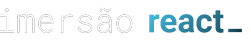
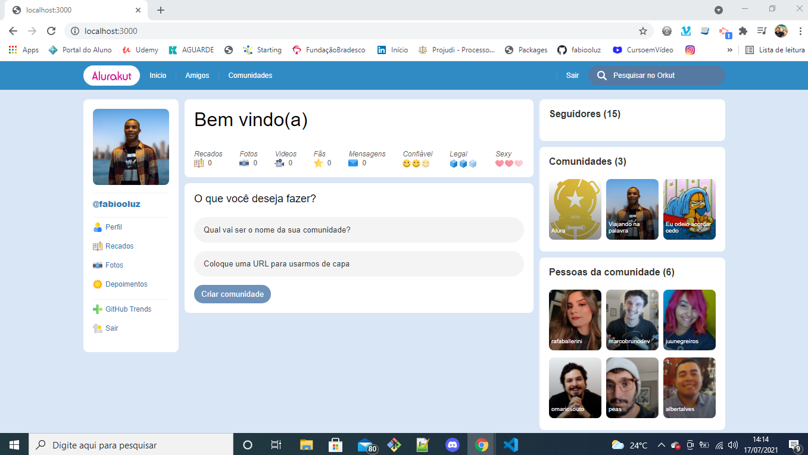

<div align="center">



 

</div>
 

Projeto desenvolvido durante a Imersão React promovida pela [Alura](https://www.alura.com.br/).


## 💻 Tecnologias
 - [React](https://reactjs.org)
 - [Next.JS](https://nextjs.org/)
 - [styled-components](https://styled-components.com/)


### Layout base

- [Link para o Figma](https://www.figma.com/file/xHF0n0qxiE2rqjqAILiBUB/Alurakut?node-id=58%3A0) 


### 💻 Como executar o Projeto:
 

### Requisitos

- Você precisa instalar [Node.js](https://nodejs.org/en/download/) e [Yarn](https://yarnpkg.com/) para executar este projeto.

**Clone o repositório e acesse a pasta**

```bash
$ git clone https://github.com/fabiooLuz/alurakut.git && cd alurakut
```


**⚙️ Instalação das dependências**

```bash
# Baixe as dependências
$ yarn install
# ou
 npm install

# Execute o projeto
$ yarn dev
# ou
 npm run dev

# Execute o servidor web
$ yarn dev
```


*O aplicativo estará disponível para acesso em seu navegador em:* `http://localhost:3000`


### Conteúdo das aulas ✔️ 
 - Aula 1: Components com React, Styled Components e NextJS
 - Aula 2: React, State e o primeiro Formulário
 - Aula 3: Hooks no React. useEffect e protocolo HTTP
 - Aula 4: Requisições com GraphQL, BFF e AJAX!


---

By Fábio Luz 👋 [Confira meu LinkedIn](https://www.linkedin.com/in/fabiooluz/)